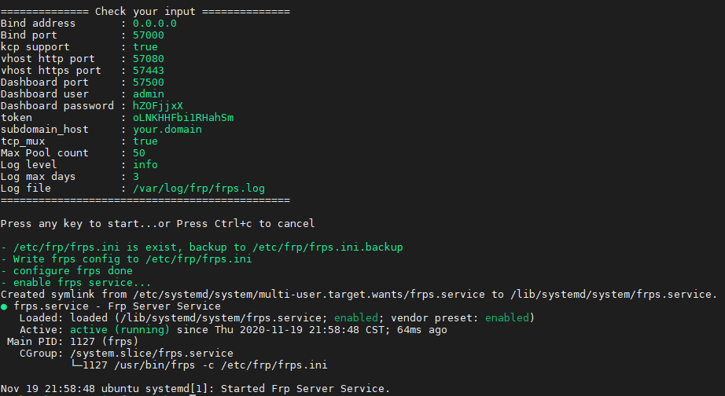
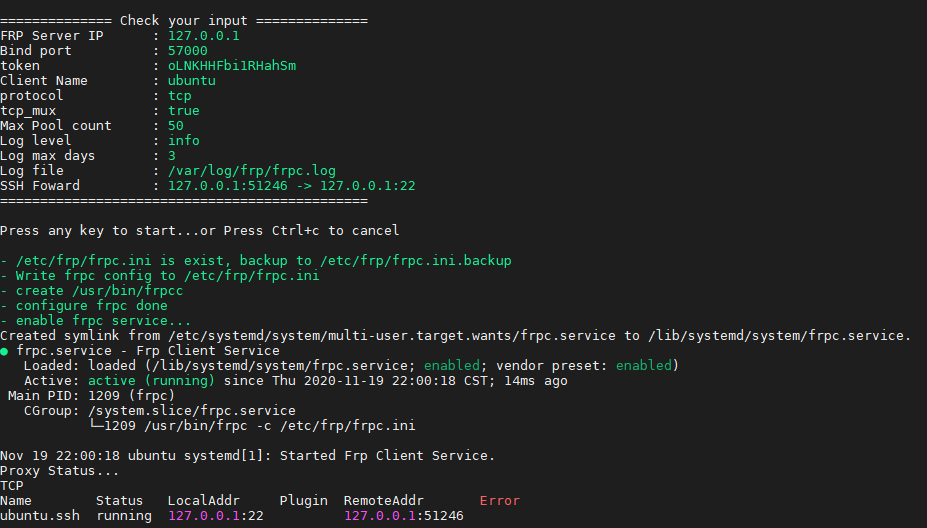

About
-----------

Frp一键配置脚本，修改自 [clangcn](https://github.com/clangcn/onekey-install-shell) ，frp版本 0.34.2

- frp服务端、客户端一键安装，配置、删除
- 使用frp包自带的service管理启动服务
- 支持多实例服务，默认实例名为**main**
- 在ubuntu/debian上测试

## Usage

### Install

```Bash
wget https://github.com/sseaky/frp-onekey/raw/main/frp_manage.sh
sudo bash frp_manage.sh -a install -c {frps|frpc}
```
or

```bash
sudo bash frp_manage.sh -a install -c {frps|frpc} -i <instance>
```

### Reconfig

```bash
sudo bash frp_manage.sh config {frps|frpc}@<instance>
```

or

Modify the config file in /etc/frp/ and restart service manually.

### Uninstall

```Bash
sudo bash frp_manage.sh -a uninstall
```

### Service

```bash
sudo systemctl {status|start|stop|restart} {frps|frpc}@<instance>
```

### Reload

```bash
frpc@<instance> {status|reload}
```

## Example

### frps



### frpc




