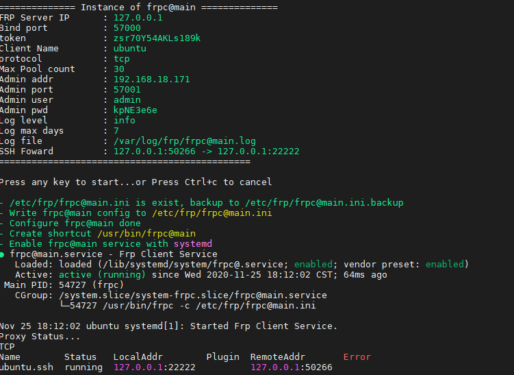

About
-----------

Frp一键配置脚本，修改自 [clangcn](https://github.com/clangcn/onekey-install-shell) ，frp版本 0.34.2

- frp服务端、客户端一键安装，配置、删除
- 支持systemd或rc管理服务
- 支持多实例服务，默认实例名为**main**
- 在ubuntu/debian上测试

## Usage

### Install
```bash
sudo bash -c "bash <(wget -qO - https://github.com/sseaky/frp-onekey/raw/main/frp_onekey.sh) -a install -c {frps|frpc} [-i <instance>]"
```
or
```Bash
wget https://github.com/sseaky/frp-onekey/raw/main/frp_onekey.sh
sudo bash frp_onekey.sh -a install -c {frps|frpc} [-i <instance>]
```

如果wget碰到 

```
Connecting to raw.githubusercontent.com (raw.githubusercontent.com)|151.101.228.133|:443... failed: Connection refused.
```

尝试以下方法：

- 更换dns
- wget --no-check-certificate https://github.com/sseaky/frp-onekey/raw/main/frp_onekey.sh
- 挂代理
- 手工复制内容到服务器

### Reconfig

```bash
sudo bash frp_onekey.sh config {frps|frpc}@<instance>
```

or

Modify the config file in /etc/frp/ and restart service manually.

### Uninstall

```Bash
sudo bash frp_onekey.sh -a uninstall
```

### Shortcut

```bash
sudo frps@<instance> {start|stop|restart|status}
sudo frpc@<instance> {start|stop|restart|status|reload}
```

## Example

### frps



### frpc


